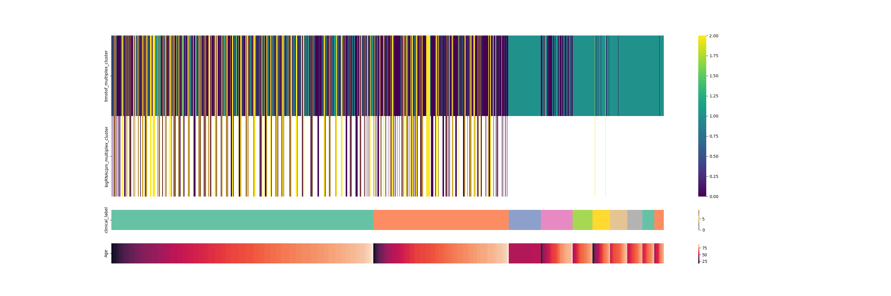
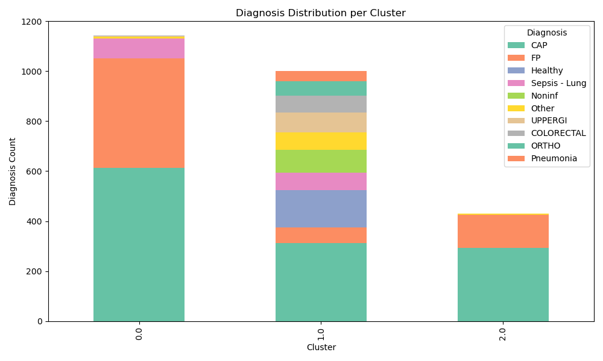
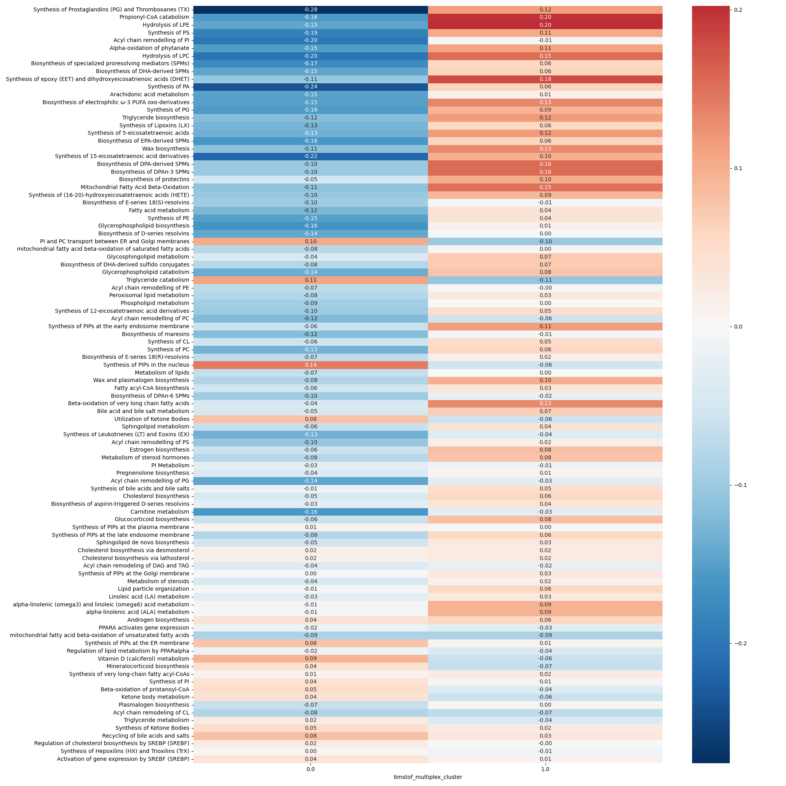

# Tutorial Part 1: Analysis of a sepsis dataset

## Introduction
We will showcase the use of MLModNet with the GAinS sepsis dataset containing proteomic and transcriptomic datasets for 800 patient-samples.

## Running MLModNet on a sepsis dataset

### Folder structure
MLModNet is a modular package with various parts. It assumes that you have the following folder structure set up:
- /ProjectRoot
    - /code
        - /COGENT_python
        - /multilayer_python
        - /snippets
    - /options
        - basic_parameters.tsv
        - modality_preprocessing_parameters.tsv
        - COGENT_options.csv
    - /data
    - /output
        - /preprocessed_sorted_data
        - /variability_plots
        - /cogent_outputs

### Setting up the environment

First run the setup script:
```bash
cd code/snippets
python setup_parameter_files.py
```
Now, copy your data to the data folder. MLModNet assumes that they are tab-delimited files (*.tsv), where the first column contains features (gene names, protein names, etc.), first row is the header, containing sample IDs (patient IDs) and the value at (i, j) position represents the value of feature i for sample j. 

Also copy the clinical metadata file into this folder. It should be called "clinical.csv" and have sample information stored in rows, with samples uniquely identified by their ID, column called "SampleID", and columns representing clinical features.

The package is cappable to make some frequent preprocessing steps, like transposing the data, renaming the sample IDs or handling other delimiters than tabs. Check [Preprocessing](getting_started.md) for more information.

The sepsis dataset we will use is already in this format, so no changes are needed. If your data is in a different format, modify accordingly the `options/modality_preprocessing_parameters.tsv` file.

The sepsis dataset contains two modalities: timstof and logcpm-transformed RNA-seq data (logRNAcpm). The `modality_preprocessing_parameters.tsv` therefore has a header and two rows. If your datasets conform to the format, the only two columns that need filling in are: modality_name and file_path (to point where the files are located and what they are called). The other columns allow for different delimiting characters, transposing, and renaming the sample IDs but they can be left with the defaults. This is what the file should look like:

| modality_name | file_path                                                 | sep | transpose | rename_sample | feature_ID_name | modality_ID_name   |
|---------------|-----------------------------------------------------------|-----|-----------|---------------|----------------|--------------------|
| timstof       | /home/username/MLModNet/data/sepsis_timstof_with_names.tsv |"\t"|0|0|||
| logRNAcpm    | /home/username/MLModNet/data/logRNAcpm.tsv |"\t"| 0             | 0              |||

General parameters are set up and stored in `options/parameters.tsv` file. They can be changed, in particular, when your ID column is not called "SampleID" or if you want to run the analysis on a subset of samples (e.g. only the hospitalized patients). More in [Subset analysis](getting_started.md).


### Filtering and sorting the modality files

Features variability (measured by standard deviation) is affected by its median value across samples. Some genes can seemingly vary a lot, but the magnitude of this variability may be due to the scale this feature is on (median). This is why we sort features based on how much more they vary than expected at their level of activity. We fit a regression line through features' median values and then sort features by their distance from the line (the highest above the line is ordered as first, most variable feature).

Let's now perform this variability analysis.

To run it for a specific dataset, using log scale for the plotting, and with 0.5 as the cut-off value for gene variability, we will run the following command.
```bash
python ../multilayer_python/variability_analysis.py {dataset} 0.5 --log_scale --regression --modality_parameters_file_path {dataset_file}
```

To do this for all the modalities, we run the following commands:

```bash
 python run_variability.py
```

This function runs the `variability_analysis.py` function for all the lines from the `modality_parameters_file_path` file.
This should run quickly and produce processed files and associated variability plots. 
#### Variability for RNAseq


#### Variability for timstof


Now we can proceed to the COGENT stability analyses.

### COGENT

COGENT is the lengthiest part of this pipeline. In this part, for each modality, we will determine what network construction procedure results in most perturbation-resistant networks. First, the setup.

`/home/username/MLModNet/COGENT_options.csv` has a bunch of options that you can play around with, but the defaults can be generated through running:

```bash
python ../multilayer_python/create_COGENT_options_from_processed_files.py
```
This will create a file, called `COGENT_options.csv` in the `options` folder. It will contain the default options for COGENT with Pearson correlation.

Now we actually need to run COGENT, and there is a convenient wrapper that uses all the previous files we generated to figure out how to run COGENT.

```bash
python ../COGENT_python/cogent_subsets_code.py '../../options/COGENT_options.csv'
```

This will take a while, but will calculate the optimal networks and network construction approaches, as well as levels of variability that they exhibit, compared against randomized networks. 

This will generate a bunch of files, which we can now proceed to visualizing. 

We will run `slice_and_surface_plots.py`:
```bash
python ../multilayer_python/slice_and_surface_plots.py
```
This should produce visualizations of how consistent the networks stay upon minor perturbations with a range of network construction approaches.

#### COGENT RNA results
Before normalizing:


After normalizing:


#### COGENT timstof results
Before normalizing:

After normalizing:


Finally, let's create a multilayer network!


### Multilayer Networks!

Finally we will connect all the modalities' layers into a multilayer network. We do it by principled coupling of the nodes between layers and by then running an adapted Leiden algorithm on the multilayer network, by default with Modularity Vertex Partition. This results in a patient-sample stratification, which can be different across layers (thereby uncovering further information, while keeping the integrated nature of the stratification).

#### Clusters across layers with clinical descriptors

And the meaning of the colors in the second panel is illustrated by this legend:

#### Timstof cluster's diagnosis distribution 


#### Timstof cluster's stability 
We need to be confident in the stability of our clusters or at least, understand how stable they are. Leiden Algorithm is stochastic in its nature, so may lead to different clusterings each time. However, if the clusters are sufficiently distinct, there should not be too much variability between different runs. To assess the stability of the clustering, we run the multilayer community detection 1000 times. We then show the cluster assignments across the runs as rows. 

We see that clustering is very stable for the sepsis dataset, as almost all samples co-cluster identically across runs.

### Exploring the clinical meta-data enrichments

Our clusters are stable, but what do they mean? We will explore this now, through exploring enrichments in different clinical meta-data features.
In the sepsis dataset, we have access to a column named "Diagnosis", which contains the label a patient was assigned by a clinician. We want to understand whether the clusters that we identified can be associated with certain diagnosis types.

We create 1000 random cluster assignments by shuffling. We then compare the observed distribution of diagnoses to these random distributions to see, if clusters have more diagnoses of a certain type than expected through random chance. 

We visualize it as both, distribution plots and z-score heatmap. We see that MLModNet identifies clusters with distinct, non-random diagnosis enrichments. E.g. cluster 0.0 has a z-score of -8.5 for FP (feacal peritonitis) and 8.5 for CAP (community acquired pneumonia), while cluster 1.0 has a z-scores of 4.1 and -3.9 respectively; cluster 2.0 exhibits similar pattern to cluster 1.0.


We can do this type of analysis for all categorical features in the clinical meta-data.

We can also create similar plots for quantitative features, upon applying a aggregation approach (test-statistic) to them (e.g. median). You can generate these plots by running:
```bash
python ../multilayer_python/cluster_drawing.py {k} {clinical_column} {quant_column}
```
where `k` is filtering out infrequent diagnoses (less than k examples in dataset), `clinical_column` is the clinical variable you want to plot (Diagnosis) and `quant_column` - the quantitative feature you want to visualize (Age).

### Pathway enrichments

Next, we want to better understand what the molecular underpinnings of the clusters are. For that, we will calculate pathway activity for each of the patients and aggregate it at the cluster level. We can only do it for the patients that have RNA-seq data. Upon running:
```bash
python ../multilayer_python/pathway_plots.py
```
we obtain the following plots in the `output/pathway/` directory:
- {pathway_name}_cluster_pathway_plots_network.png
- {pathway_name}_heatmap_pairs_contrasts.png
- {pathway_name}_heatmap_absolute_values.png
- {pathway_name}_pathways_violing_{pair}.png showing the top 10 most different pathways for each pair
- {pathway_name}_network_{cluster1}_vs_{cluster2}.png for each pair of clusters, showing the Reactome tree of pathways anchored on {pathway_name}

#### Overview of 3 most important pathways per cluster pair


#### Aggregated pathway activities

#### Mann Whitney U contrasts for each pair

#### Reactome Tree view of pathways

#### 10 most contrasting pathways as violinplots
.png)

### Survival analysis

TODO

### Molecular feature enrichments

### Running it all at once
All of these steps can be also run by running this from the snippets folder with the virtual environment enabled:

```bash
python run_all.py
```